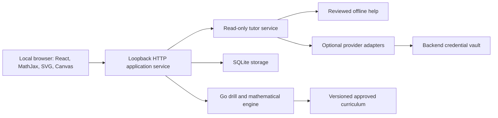

# Architecture

## Runtime

The launcher serves compiled frontend assets and opens a loopback URL. Use a dynamic port by default and print the address if browser opening fails. Development uses a Vite proxy to Go; production needs neither a Vite server nor Node. Embed compiled assets, approved curriculum and required math/fonts in the binary using Go embed. Resolve a deterministic embed path in Stage 01; builds must fail if the frontend bundle is absent.

## Package ownership

| Package | Responsibility |
|---|---|
| internal/domain | Plain types: family/template/instance/version, stages, answers, assistance, attempts, session state |
| internal/mathengine | Set/distribution/moment/statistics rules, stable numeric computations; pure apart from injected RNG |
| internal/bank | Strict bank loading, supported-family registry, parameter constraints, content review metadata |
| internal/drill | Stage building, misconception mapping, answer normalization and grading from canonical results |
| internal/mastery | Evidence projection, decay, transfer conditions and scheduler using injected clock/RNG |
| internal/storage | Migrations, immutable snapshots, transactions, notes, exam and arcade persistence |
| internal/tutor | Read-only requests, OfflineTutor, provider orchestration, budgets/cancellation |
| internal/providers | OpenAI-plan/OpenAI-API/Anthropic/Gemini protocol adapters and model catalogs |
| internal/auth | Backend vault, account profiles, OAuth transactions, redaction and credential lifecycle |
| internal/exam | Assessment policy, deadline, snapshot-based resume and reports |
| internal/httpapi | Session commands, DTOs, origin/session validation and streamed tutor transport |
| internal/app | Composition, application services and transactional coordination |
| internal/assets | Build-time embedding boundary for compiled UI and public assets |
| cmd/quant-practice | CLI parsing, startup/shutdown, administrative commands |
| web/src/features | Practice, exams, notes, providers, reference, progress and candidate-review views |
| web/src/navigation | Central command resolver, focus/mode handling, leave-intent state machine |
| web/src/components | MathMarkdown, answer fields, stage/question strips, accessible controls |
| web/src/visuals | SVG diagrams, plots and seeded teaching simulation display |
| web/src/arcade | Pure TypeScript fixed-step game simulation plus Canvas renderer and input adapter |

Go domain/mathengine cannot import storage, providers, HTTP or browser code. Drill may depend on domain/mathengine/bank; mastery consumes immutable evidence, not UI state. Application services orchestrate mutations. Providers return prose or candidate data only. Arcade math is isolated from statistical grading math.

## Authoritative state

Go owns session order, active snapshots, response eligibility, assistance state, grade, exam deadline and mastery. The browser owns focus, open panels, draft text and visualization display state. After reload it asks Go for canonical state, restores permitted local drafts, and never infers a completed stage from DOM markup.

No full answer key is sent with an unresolved question. API projections expose public stage content and permitted prior feedback only. Previous/future stage navigation follows pedagogical eligibility; reading a solution or helpful later stage marks exposure before any later submission. Server checks this even if a client skips UI controls. Exam projections withhold answers/hints/explanations until completion.

Question-generation, numerical plots and recap values share the same canonical rule snapshot. SVG coordinates do not become answer keys. Browser simulations can illustrate random behavior, but deterministic expected values and graded results come from Go.

## Decisions to preserve

Keep the first deployment local. A hosted browser-only build would require a separate data, authentication, secret-storage and billing design. A desktop wrapper may later provide a window and native vault bridge, but must not split mathematical truth. Keep architecture modular without premature plugin servers or distributed services.
